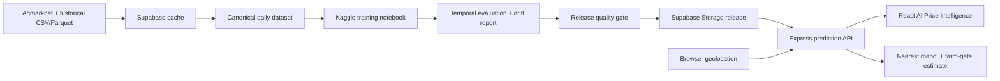

# Grainology

Grainology is a full-stack agricultural intelligence platform that combines live Agmarknet market data with state-wise and mandi-level commodity price forecasting. The application serves 7, 30, and 90-day forecasts for Wheat, Paddy, Maize, and Mustard through a React dashboard backed by an automated Kaggle-to-Supabase release pipeline.

## What This Project Demonstrates

- End-to-end ML engineering: ingestion, canonicalization, feature engineering, training, temporal evaluation, release validation, deployment, and monitoring.
- Leakage-safe forecasting: horizon embargoes, chronological calibration and holdout windows, training-only imputations, and temporal promotion gates.
- Ensemble modeling: CatBoost, LightGBM, XGBoost, histogram gradient boosting, Extra Trees, Random Forest, optional Optuna tuning, and persistence baselines.
- Location-aware product behavior: nearest-mandi lookup, Haversine distance, and configurable farm-gate price estimates after transport and handling costs.
- Production resilience: immutable release artifacts, checksums, champion/challenger quality gates, drift reports, cached last-good releases, and daily GitHub Actions automation.
- Explainable user experience: state/mandi context, calibrated prediction intervals, backtest tables, efficiency charts, and Gemini-enriched reasoning.

## Architecture



## Model Evaluation

The current pipeline writes `evaluation_report.json` for the final untouched temporal holdout. Reported model metrics should come from this artifact, not from random splits or the long-history visualization. A candidate release is rejected when required forecasts are missing, national MAPE exceeds the configured ceiling, or performance regresses materially against the active champion.

The historical efficiency chart intentionally contains long-run persistence comparisons outside the final holdout. It is useful for product transparency, but it is not the source of resume or benchmark claims.

## Reproduce Locally

```bash
npm ci
npm run ai:patch-mandi-notebook
npm run ai:validate-release
npm run build
```

The default `showcase` notebook profile is designed for dependable daily execution. It keeps the audited evaluation and release pipeline but skips Optuna and a second full mandi retraining pass. Build the heavier experimental notebook separately with:

```bash
npm run ai:build-research-notebook
```

Run the application with:

```bash
npm run dev:all
```

The working notebook baseline is versioned at `kaggle/grainology_model_base.ipynb`. `npm run ai:patch-mandi-notebook` preserves its live-price and diagnostic workflow, replaces model training with the audited temporal implementation, and generates the standalone `kaggle/grainology_mandi_forecaster.ipynb`. It does not import project files at Kaggle runtime.

## Documentation

- [ML engineering case study](docs/ML_ENGINEERING_CASE_STUDY.md)
- [Forecasting model card](docs/MODEL_CARD.md)
- [Mandi-level prediction contract](docs/MANDI_LEVEL_AI_PREDICTION_CONTRACT.md)
- [AI release architecture](docs/AI_PREDICTION_ARCHITECTURE.md)
- [Production automation checklist](docs/PRODUCTION_AUTOMATION_CHECKLIST.md)
- [Developer guide](docs/DEVELOPER_GUIDE.md)

## Responsible Use

Forecasts and farm-gate values are decision-support estimates, not guaranteed sale prices. Farm-gate estimates use configurable average transport and handling assumptions; actual costs vary by route, vehicle, load, market fees, and local conditions.

# grainology_main
